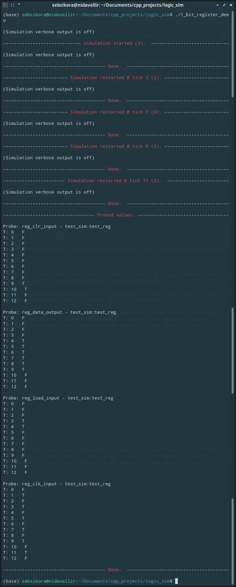

[Back to the front-page](https://github.com/sebsikora/cpp_logic_simulation)

1_bit_register_demo.cpp
-------------------------

This demo simulates the function of a simple clocked 1-bit storage register with discrete *load* and *clear* control inputs, comprising a single master-slave JK flip-flop and a number of AND, OR and NOT gates. Take a [look in](../sim_src/devices.cpp) `./sim_src/devices.cpp` to explore further.

On a high to low clock transition the state applied to the register's data input is stored and passed-through to it's data output if the *load* input is high (true). If the the *clear* input is held high during the high to low clock transition, the stored state is cleared, IE set to low (false).

If we run the simulation we will see the following output. The register's data input is held high (true) throughout. The register's *load* input is held high during the high to low clock transition from tick 3 to 4, and we see the high state appear at the register's data output in tick 4. The register's *clear* input is held high during the high to low clock transition from tick 9 to 10, and we see the high state cleared from the register's data output in tick 10.

It is easy to imagine that a wider register could be constructed by combining multiple 1-bit registers, and that these could be [arrayed programmatically](n_bit_register_demo.md).

[Back to the front-page](https://github.com/sebsikora/cpp_logic_simulation)
