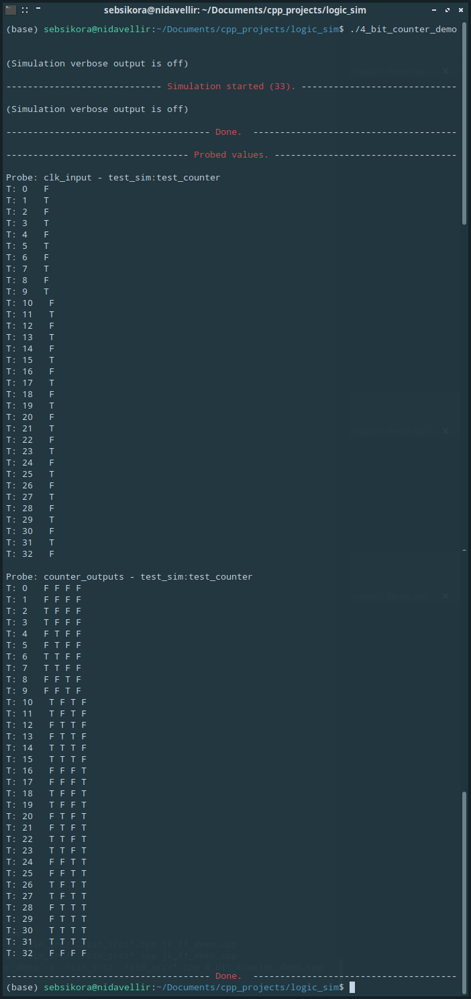

[Back to the front-page](https://github.com/sebsikora/cpp_logic_simulation)

4_bit_counter_demo.cpp
-------------------------

This demo simulates the function of a simple [4-bit synchronous up-counter](https://www.electronics-tutorials.ws/counter/count_3.html).

The 4-bit counter Device comprises four master-slave JK flip-flop Devices and two 2 input AND gates, as shown [here](https://www.electronics-tutorials.ws/wp-content/uploads/2018/05/counter-cou4.gif), except that in this case rather than connecting the *j* and *k* high (to logic '1'), they are both connected to the Device's *run* input. Take a [look in](../sim_src/devices.cpp) `./sim_src/devices.cpp` to explore further.

If we run the simulation we will see the following output. As the counter internally comprises jk flip-flops, it's starting output state will be random (just like a real simple binary counter). With the *run* input held high (true), the counter will count upwards from zero on each high to low clock transition and we will see this reflected on it's four outputs. The counter will overflow back to zero after reaching it's maximum (b1111 = 15).

[Back to the front-page](https://github.com/sebsikora/cpp_logic_simulation)
