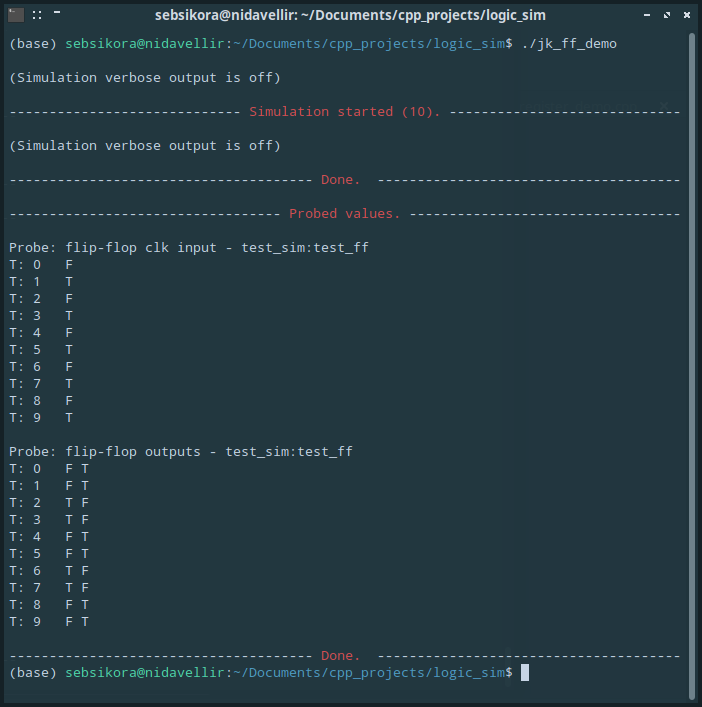
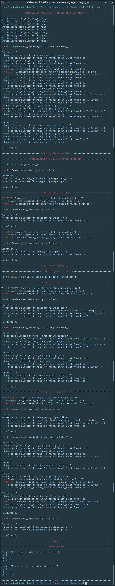

[Back to the front-page](https://github.com/sebsikora/cpp_logic_simulation)

jk_ff_demo.cpp
-------------------------

This demo simulates the function of a [master-slave JK flip-flop](https://www.javatpoint.com/master-slave-jk-flip-flop-in-digital-electronics).

A [flip-flop](https://www.javatpoint.com/basics-of-flip-flop-in-digital-electronics) is a form of [sequential logic](https://www.electronics-tutorials.ws/sequential/seq_1.html) that is bi-stable, IE - it has two stable states between which it can transition. Digital logic circiuts rely on them as the basic storage unit, and they can be combined in number and with other logic gates to form sophisticated digital devices. Flip-flops can be ['clocked' or 'un-clocked'](https://www.javatpoint.com/sequential-circuits-in-digital-electronics), depending on type.

The [JK flip-flop](https://www.electronics-tutorials.ws/sequential/seq_2.html) is a clocked flip-flop that is known as a *universal flip-flop*. This means that all other flip-flops can be created using circuits comprising one or more JK flip-flops.

An issue with the JK flip-flop is that it's operation is sensitive to the timing of the pulses applied to the clock input. Two JK flip-flops can be connected with a NOT gate to form a [master-slave JK flip-flop](https://www.javatpoint.com/master-slave-jk-flip-flop-in-digital-electronics), which reproduces the behavior of the simple JK flip-flop, but changes output state only upon high to low transitions at the clock input, irrespective of the duration of the clock pulses. This 'robustness' makes it easy to reason about it's function, and makes it fully-static, so we can use it as a building-block in our simulations.

The master-slave JK flip-flop demonstrated here is constructed from 2 input and 3 input NAND gates, and a single NOT gate, as shown [here](https://www.electronics-tutorials.ws/wp-content/uploads/2018/05/sequential-seq14.gif). Take a [look in](../sim_src/devices.cpp) `./sim_src/devices.cpp` to explore further.

If we run the simulation we will see the following output. With both the *j* and *k* inputs held high (true), the opposite outputs *q* and *not_q* should toggle with each high to low clock transition. The internal state of any Device is initially settled to a stable static state by randomising all of the Gate inputs prior to solution. Due to this, the flip-flops *q* and *not_q* outputs will stabilise to random complementary states, as in the case of the real device. 

If we compile `jk_ff_demo.cpp` with `verbose = true` and `monitor_on = true`, we can watch the state changes triggered by the clock transitions propagate through the circuit's gates. We will only simulate 1 clock transition from high to low to keep the verbose output a manageable length.

[Back to the front-page](https://github.com/sebsikora/cpp_logic_simulation)

