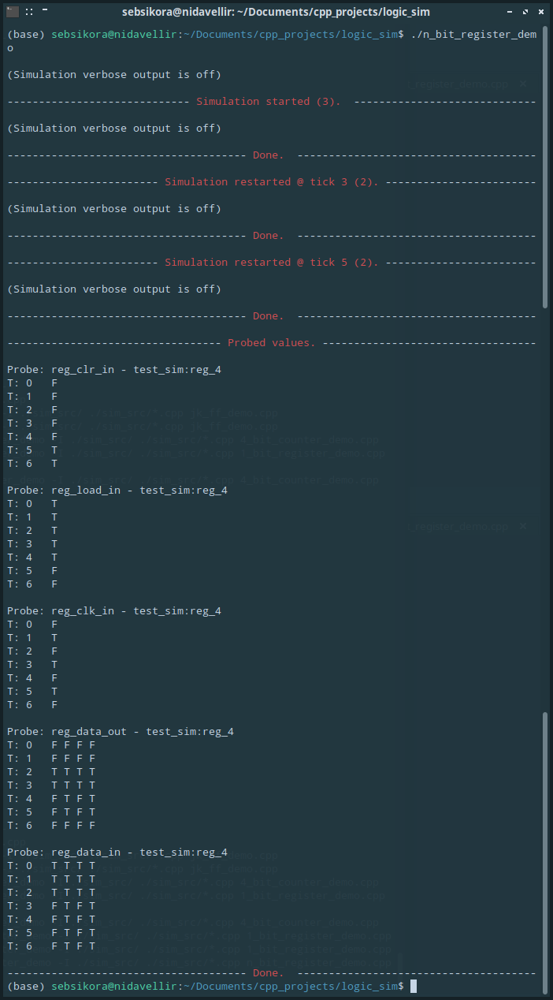
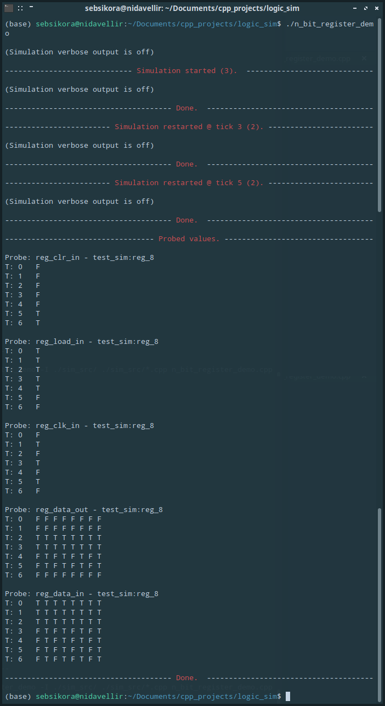
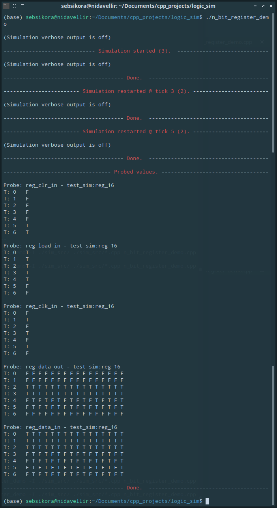
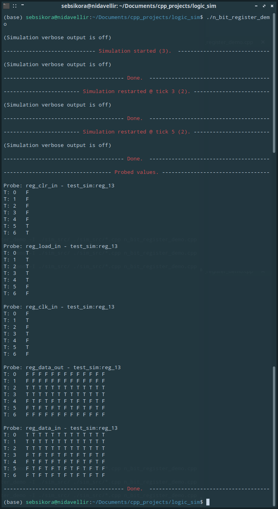

[Back to the front-page](https://github.com/sebsikora/cpp_logic_simulation)

n_bit_register_demo.cpp
-------------------------

This demo simulates the function of a clocked n-bit storage register with discrete *load* and *clear* inputs, the bit-width of which is set via parameter upon instantiation. A multi-bit storage register is an essential part of sequential digital logic circuits. 

The register is programmatically generated using conventional programming approaches from an array of 1-bit registers (demonstrated in [another demo](1_bit_register_demo.md)). Take a [look in](../sim_src/devices.cpp) `./sim_src/devices.cpp` to explore further. It is easy to imagine using a similar programmatic approach to create an n-bit counter, or other such logic devices internally predicated on repeated logic 'units'.

Edit the `register_width` value towards the top of the demo to set a custom register-width. 

If we run the simulation with `register_width = 4` we will see the following output. As the register internally comprises jk flip-flops, it's starting output state will be random (just like a real register).

As the Device is generated programmatically, it is trivial to generate different register widths. 8-bit:

How about 16-bit?

We can just as easily generate a (much less common) register of odd-width. 13-bits? Unlucky for some!

[Back to the front-page](https://github.com/sebsikora/cpp_logic_simulation)
