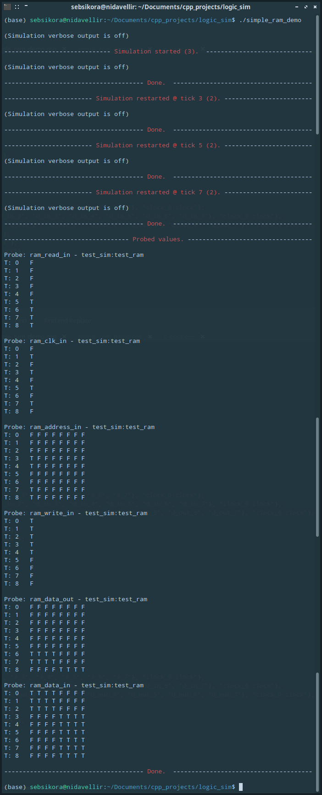

[Back to the front-page](https://github.com/sebsikora/cpp_logic_simulation)

simple_ram_demo.cpp
-------------------------

This demo simulates the function of a [static RAM IC](https://en.wikipedia.org/wiki/Static_random-access_memory). As in the case of the SimpleRom demonstrated [here](simple_rom_demo.md), this could be acheived with a normal *Device* comprising an array of registers and encoders/decoders, but we will again use it as an opportunity to demonstrate the *MagicDevice* class (which should also be a lot faster in simulation).

The principal of operation is very similar to that of the SimpleRom. Again, storage is provided by an array, the size of which is determined according to two parameters that are passed at instantiation that provide the desired data word width and number of words that the SimpleRam can access.

The SimpleRam has three control inputs, *clk*, *read* and *write*, address bus and data bus inputs, and data bus outputs. Upon a high to low transition applied to the *clk* input, if the *load* control input is held high (true), the *MagicEngine* fetches the data word stored in the array that corresponds to the address on the address bus input, and outputs the corresponding states on the SimpleRam's data bus output. Conversely, if the *write* control input is held high (true) during a high to low clock transition, the states applied to the data bus input are stored in the array at the position indicated by the address on the address bus inputs. Take a [look in](../sim_src/simple_ram.cpp) `/sim_src/simple_ram.cpp` to explore further.

If we run the simulation we will see the following output. With the *write* control input held high (true), two different words are written to the first two consecutive addressess on the first two high to low clock transitions (ticks 1 to 2 & 3 to 4). The *write* control input is then set low (false) and the *read* control input held high during the next two high to low clock transitions (ticks 5 to 6 & 7 to 8).

[Back to the front-page](https://github.com/sebsikora/cpp_logic_simulation)
