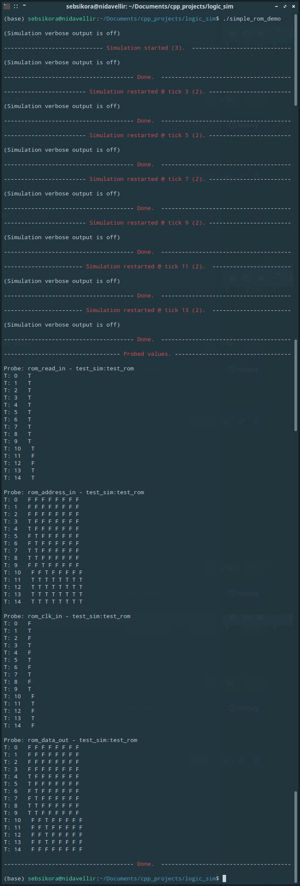

[Back to the front-page](https://github.com/sebsikora/cpp_logic_simulation)

simple_rom_demo.cpp
-------------------------

This demo simulates the function of a [ROM IC](https://en.wikipedia.org/wiki/Read-only_memory). We could in principle acheive this by actually creating the arrays of gates that in reality comprise a memory IC via programmatic means, but instead we will use this as an opportunity to demonstrate a *MagicDevice*.

In this case, the *MagicDevice* constains no conventional *Components* at all, only the *MagicEngine* containing the functional code. At instantiation of the SimpleRom the path to a text data file is passed as an argument, and the contents of the file are read into an array. This data file contains binary words encoded as a comma separated string of 1s & 0s, terminated by a newline character, one binary word per row. The width of the required address bus inputs and data bus outputs are determined automatically according to the contents of the data file.

The SimpleRom has two control inputs, *clk* and *read*. When read is held high (true) during a high to low clock transition, the *MagicEngine* fetches the data word located at the row specified by the address bus inputs and outputs the corresponding states on the data bus outputs. Take a [look in](../sim_src/simple_rom.cpp) `/sim_src/simple_rom.cpp` to explore further.

If we run the simulation passing the SimpleRom the file path to the supplied `data.txt` we will see the following output. By holding the *read* input high (true), and incrementing the address bus input by one every other tick, we see stored states fetched from memory and output on the data bus on each high to low clock transition. On tick 11 we set the address bus input to it's maximum value (which points to an empty data word in the file), and on the next high to low clock transition we see this state output on the data bus. When the *read* input is not held high, the state of the data bus output does not change.

[Back to the front-page](https://github.com/sebsikora/cpp_logic_simulation)

