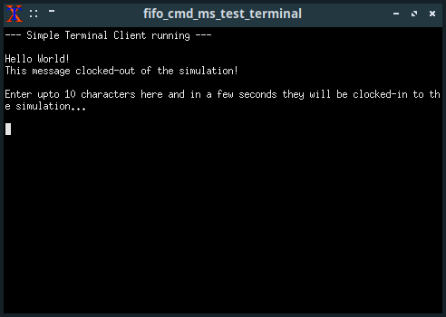

[Back to the front-page](https://github.com/sebsikora/cpp_logic_simulation)

simple_terminal_demo.cpp
---------------------------

You will also need...
---------------------------

To run this demo, in addition to compiling `simple_terminal_demo.cpp`, you will need to compile and link `./simple_terminal_client/terminal_client.c` using a C compiler (for example GCC), which will also require the [ncurses](https://www.osetc.com/en/how-to-install-ncurse-library-in-ubuntu-debian-centos-fedora-linux.html) library.

The path to the terminal_client binary is hard-coded within the SimpleTerminal *MagicDevice*, and as-such the easiest thing to do is to compile it in-place. For example, to compile `terminal_client.c` using the GNU C compiler on a Linux system enter the following on the command-line from within the `./simple_terminal_client` sub-directory:

`gcc terminal_client.c -o terminal_client -lncurses`

Note the `-lncurses` option at the end to link against the ncurses library.

Lastly, you will need to make sure the [Xterm](https://invisible-island.net/xterm/) terminal emulator is installed on your system at `/usr/bin/xterm`. The way in which arguments have to be passed to the terminal emulator when spawning it within a new process, and running another binary 'within it', appear to be terminal emulator specific, and have so-far been developed and tested-against Xterm. For this reason, as it stands the SimpleTerminal *MagicDevice* works only with Xterm, which it expects to find at `/usr/bin/xterm`

What is it?
---------------------------

This demo simulates the function of a simple UART-like 'communications' IC, and provides a 'user terminal' with which it can communicate in a separate window. Of the demonstrations presented, this is the one that most obviously 'breaks the fourth wall' between the simulation and the rest of the system, and provides a way for us to interact directly with the simulation 'live'.

Upon instantiation the SimpleTerminal *MagicDevice* creates some file-like first-in first-out (fifo) inter-process communication buffers and then spawns an additional process running the [Xterm](https://invisible-island.net/xterm/) terminal emulator. We can pass arguments along with the path to the Xterm binary, which we use to provide the path to the terminal_client binary and file-like communication buffers. This results in our terminal_client running in a separate window, in posession of a way to communicate with the running simulation.

At the terminal_client end, any characters 'arriving' via the simulation->terminal buffer are printed to the terminal immediately. Any characters entered by the user are put in the terminal->simulation buffer. At the simulation end, every tick the *MagicEngine* within the SimpleTerminal checks the terminal->simulation buffer to see if any characters have arrived. Any that have are copied into an internal fifo buffer, and if internal buffer was previously empty the SimpleTerminal's *data_waiting* control output is brought high (true). When the SimpleTerminal's *read* control input is held high, on each high to low transition at the *clk* control input the 'oldest' character in the fifo buffer is output on the SimpleTerminal's data output pins. When there are no characters remaining in the fifo buffer, the *data_waiting* control output is brough low (false). When the SimpleTerminal's *write* control input is held high, on each high to low clock transition at the *clk* control input the states of the data input pins are read, encoded as a character and placed in the simulation->terminal buffer.

Unfortunately, the way in which this is implemented is not platform-independent, and as such the SimpleTerminal *MagicDevice* will only run on Linux systems.

Running the demo
---------------------------

So, with the Xterm binary located at `/usr/bin/xterm` and `terminal_client.c` compiled and the resulting binary located at `./simple_terminal_client/terminal_client`, we run `./simple_terminal_demo` from within the cpp_logic_simulator directory.

Upon instantiation the SimpleTerminal spawns the terminal_client in a new Xterm window and prints several messages to it. The first is a header generated internally by the *MagicEngine* to demonstrate that it is working properly. The subsequent greeting is generated programatically within the demo by clocking characters from an example string into the SimpleTerminal's data input pins character-at-a-time with the *write* control input held high.

The demo then pauses the simulation for `seconds_to_pause_simulation` seconds. During this time you can enter characters via the keyboard, which the terminal_client will append to the terminal->simulation buffer. At the end of the pause (strictly at the very beginning of the first subsequent tick) the contents of the terminal->simulation buffer are copied to the SimpleTerminal's internal buffer, before the demo brings the SimpleTerminal's *read* control input high and clocks-in the oldest `characters_to_clock_in` characters, which are output on the SimpleTerminal's data output pins. If you scroll back up the Probe sample printouts you can see the changing value of the characters received from the terminal_client on the SimpleTerminal's data output pins during the last 2 * `characters_to_clock_in` ticks, changing on each high to low clock transition.

At the end of the demo the simulator's ShutDown() method ensures that the SimpleTerminal's shut down methods are called, which sends a kill command which gracefully closes the Xterm session within which the terminal_client runs, and closes (and deletes) the file-like buffers.

[Back to the front-page](https://github.com/sebsikora/cpp_logic_simulation)

